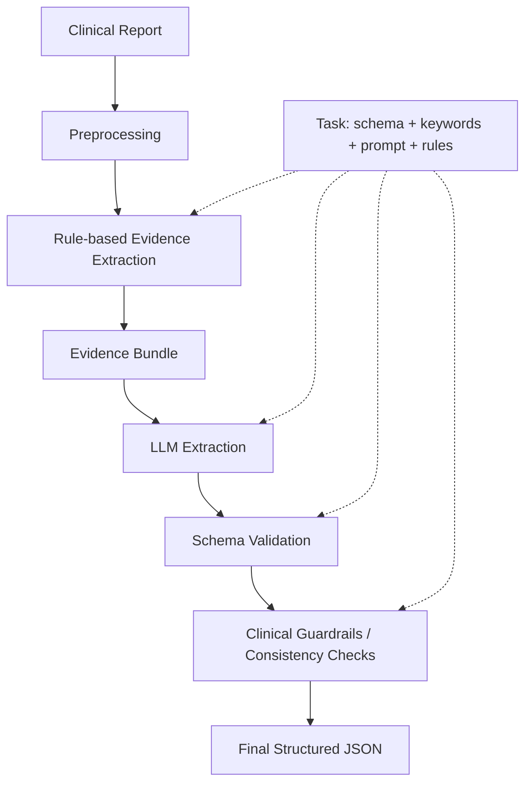

# Architecture

The framework is a single Hybrid NLP–LLM pipeline. Everything task-specific is
supplied by an `ExtractionTask`; the stages themselves are generic.

## Pipeline stages

| Stage | Module | Responsibility |
|-------|--------|----------------|
| Preprocessing | `src/preprocessing/clean_text.py`, `section_splitter.py`, `report_loader.py` | Load reports, normalize text, split sections |
| Rule evidence | `src/extraction/rule_evidence.py` | Match task keyword groups; build a bounded, section-labelled evidence bundle; flag negations |
| LLM extraction | `src/llm/llm_extraction.py` | Schema-guided JSON extraction over the evidence bundle |
| Schema validation | `src/validation/schema_validation.py` | Coerce types, normalize enums, enforce required, fill defaults |
| Guardrails | `src/guardrails/clinical_guardrails.py` | Deterministic normalization + consistency checks (no diagnosis) |
| Orchestration | `src/pipeline/pipeline.py` | Run all stages per report; write CSV + JSONL with stage audit trail + LLM reasoning |

If the rule layer finds no positive/context evidence, the LLM is skipped **unless** the task sets `send_full_text_when_no_evidence=True` (used by the cardiology smoke task).

## Audit trail (interpretability)

Every structured JSONL record includes:

- `stage_path` — ordered stage names for that patient
- `audit.stages` — per-stage actions, counts, and notes
- `audit.llm` — system/user prompts + raw model output
- `reasoning` / `evidence_quotes` — model-provided justification (when in the task schema)
- `one_hot` — enum fields expanded to 0/1 indicators for evaluation tables

## The task specification

Defined in `configs/tasks/base.py`:

- `SchemaField(name, type, required, enum, default, description)` — output schema.
  Types: `string`, `boolean`, `integer`, `number`, `enum`, `array`.
- `EvidenceGroup(name, phrases, role, priority)` — rule keyword group.
  Roles: `positive` (supports extraction), `context` (hint), `negation` (exclusion).
- `ExtractionTask(name, fields, evidence_groups, section_markers,
  negation_patterns, prompt_name, consistency_rules, ...)`.

## Guardrail / consistency rule types

`consistency_rules` is a tuple of plain dicts. Supported `type` values:

| type | shape | effect |
|------|-------|--------|
| `normalize` | `{field, map}` | Map raw values to canonical ones |
| `conditional_set` | `{if: {...}, set: {...}}` | Force dependent field values when a condition holds |
| `mutually_exclusive` | `{fields: [...]}` | At most one boolean field may be true (else contradiction) |
| `requires` | `{if: {...}, then_required: [...]}` | Listed fields must be populated when a condition holds |
| `impossible_combination` | `{when: {...}}` | Flag value combinations that cannot co-occur |

Detection rules (`impossible_combination`, `mutually_exclusive`, `requires`) are
evaluated against the raw model output; transformation rules (`normalize`,
`conditional_set`) produce the final fields. Any contradiction or missing
dependent field sets `manual_review_candidate=True`.

## Adding a task

1. Copy `configs/tasks/demo_extraction/` to `configs/tasks/<name>/`.
2. Edit `task.py`: declare `fields`, `evidence_groups`, `section_markers`,
   `negation_patterns`, `consistency_rules`, and set `prompt_name="<name>"`.
3. Create `prompts/<name>.txt` (task instructions; the schema block is appended
   automatically by `src/prompts/registry.py`).
4. Register `<name>` in `_REGISTERED_TASKS` in `configs/tasks/__init__.py`.
5. Run: `python -m src.pipeline.pipeline --task <name> --reports <path>`.

## Evaluation

`src/evaluation/compare_groundtruth.py` aligns predictions with ground-truth by
`report_id` and scores each field: binary metrics for boolean fields, accuracy +
confusion for enum/categorical fields, plus an exact-match rate.
